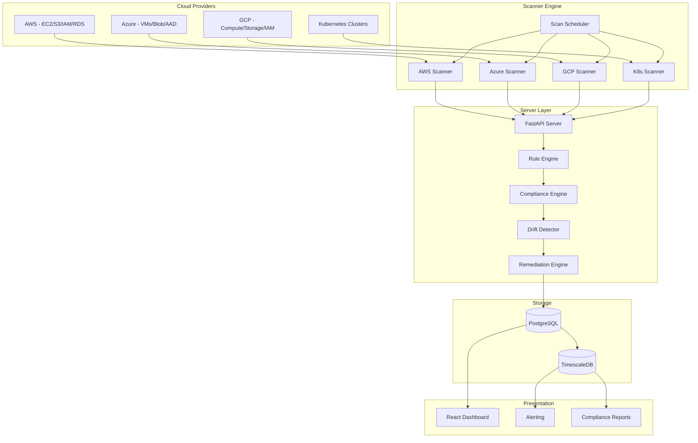

<p align="center">
  
  
  
  
  
  
  
  
</p>

<p align="center">
  <b>Cloud Security Posture Management (CSPM)</b><br/>
  Scans AWS, Azure, and GCP for misconfigurations, exposed resources, and IAM issues.
</p>

---

## 📋 Description

**Kirov Cloud Security Monitor** is a comprehensive Cloud Security Posture Management (CSPM) platform that continuously assesses your multi-cloud infrastructure against industry benchmarks (CIS, NIST, SOC 2) and custom security policies. It detects misconfigurations, overly permissive IAM policies, publicly exposed resources, and compliance violations across AWS, Azure, GCP, and Kubernetes clusters.

The monitor provides real-time visibility into your cloud security posture with actionable remediation guidance, automated compliance reporting, and drift detection. It integrates with the Kirov ecosystem to correlate cloud findings with network telemetry, threat intelligence, and incident response workflows.

---

## 🏗️ Architecture



---

## ✨ Key Features

- **☁️ Multi-Cloud Coverage** — AWS, Azure, GCP, and Kubernetes (EKS, AKS, GKE, self-managed)
- **📋 CIS Benchmark Compliance** — Automated checks against CIS AWS Foundations, Azure Foundations, GCP Foundations, and K8s CIS benchmarks
- **🔐 IAM Analysis** — Deep IAM policy analysis: privilege escalation paths, unused permissions, cross-account access, and service control policies
- **🌐 Public Exposure Detection** — Identifies publicly accessible S3 buckets, Azure Blob containers, GCP Cloud Storage, and open security groups
- **🔄 Drift Detection** — Tracks configuration changes over time and alerts on security-relevant drift
- **🔧 Auto-Remediation** — One-click and automated remediation for common misconfigurations via Infrastructure as Code
- **📊 Compliance Reporting** — Automated compliance reports for SOC 2, PCI DSS, HIPAA, NIST 800-53, and GDPR
- **📈 Posture Scoring** — Composite cloud security score with per-service, per-region, and per-account breakdowns
- **🔍 Resource Inventory** — Complete multi-cloud resource inventory with security metadata tagging

---

## 🛠️ Tech Stack

| Category | Technology |
|----------|-----------|
| **Backend** | FastAPI 0.110+ (Python 3.11+) |
| **Frontend** | React 18 + TypeScript (Vite) |
| **Cloud SDKs** | boto3 (AWS), azure-mgmt-* (Azure), google-cloud-* (GCP) |
| **IaC** | Terraform, Pulumi, CloudFormation |
| **Policy Engine** | Open Policy Agent (OPA) / Rego |
| **Database** | PostgreSQL 16 + TimescaleDB |
| **Message Queue** | RabbitMQ |
| **Containerization** | Docker, Docker Compose |
| **CI/CD** | GitHub Actions |
| **Benchmarks** | CIS Benchmarks, NIST 800-53, SOC 2 |

---

## 🚀 Quick Start

### Prerequisites

- Python 3.11+, Docker and Docker Compose
- Cloud provider credentials (AWS Access Key, Azure Service Principal, GCP Service Account)

### Installation

```bash
# Clone the repository
git clone https://github.com/Raphasha27/kirov-cloud-security-monitor.git
cd kirov-cloud-security-monitor

# Copy environment configuration
cp .env.example .env
# Edit .env with your cloud provider credentials

# Start with Docker Compose
docker compose up -d

# Or run locally:
cd server
python -m venv venv
source venv/bin/activate  # Windows: venv\Scripts\activate
pip install -r requirements.txt
uvicorn app.main:app --reload --port 8000
```

### Configure Cloud Accounts

```bash
# Add AWS account
curl -X POST http://localhost:8000/api/v1/accounts \
  -H "Content-Type: application/json" \
  -d '{"provider": "aws", "name": "Production AWS", "credentials": {"role_arn": "arn:aws:iam::123456789012:role/KirovScanner"}}'

# Add Azure subscription
curl -X POST http://localhost:8000/api/v1/accounts \
  -H "Content-Type: application/json" \
  -d '{"provider": "azure", "name": "Azure Prod", "credentials": {"tenant_id": "...", "client_id": "...", "client_secret": "..."}}'
```

### Run a Scan

```bash
# Trigger full scan
curl -X POST http://localhost:8000/api/v1/scans \
  -H "Content-Type: application/json" \
  -d '{"account_id": "1", "scanner": "full"}'

# Check results
curl http://localhost:8000/api/v1/findings?severity=critical
```

---

## 📡 API Overview

| Endpoint | Method | Description |
|----------|--------|-------------|
| `/api/v1/health` | GET | Health check |
| `/api/v1/accounts` | GET/POST | List/add cloud accounts |
| `/api/v1/accounts/:id/scan` | POST | Trigger scan for account |
| `/api/v1/scans` | GET | List all scans |
| `/api/v1/scans/:id` | GET | Scan results |
| `/api/v1/findings` | GET | List findings (filterable) |
| `/api/v1/findings/:id` | GET | Finding details |
| `/api/v1/findings/:id/remediate` | POST | Trigger auto-remediation |
| `/api/v1/compliance` | GET | Compliance posture overview |
| `/api/v1/compliance/:framework` | GET | Framework-specific report |
| `/api/v1/policies` | GET | List security policies |
| `/api/v1/drift` | GET | Configuration drift log |

---

## 🔗 Integration with Kirov Ecosystem

| Component | Integration |
|-----------|-------------|
| **[Security Dashboard](https://github.com/Raphasha27/kirov-security-dashboard)** | Feeds cloud posture scores and compliance dashboards |
| **[Cyber Automation Engine](https://github.com/Raphasha27/kirov-cyber-automation-engine)** | Auto-remediation playbooks for critical cloud misconfigurations |
| **[Threat Hunter](https://github.com/Raphasha27/kirov-threat-hunter)** | Correlates cloud IOCs with threat actor TTPs |
| **[Network Defense Platform](https://github.com/Raphasha27/kirov-network-defense-platform)** | VPC flow log analysis for cloud network threats |
| **[AI Security Assistant](https://github.com/Raphasha27/kirov-ai-security-assistant)** | IaC security scanning for Terraform/CloudFormation templates |

---

## 🔒 Security Considerations

- **Credential Management**: Cloud provider credentials are encrypted at rest using AES-256-GCM. Use IAM roles (AWS), Managed Identities (Azure), and Workload Identity (GCP) where possible.
- **Least Privilege for Scanners**: Each cloud scanner uses a read-only role with the minimum permissions required for assessment
- **Audit Trail**: All scan actions, policy changes, and remediations are logged to an immutable audit trail
- **Data Residency**: Scan results are stored in the region specified by your deployment configuration
- **Cross-Account Access**: For AWS, use secure cross-account IAM roles instead of long-lived access keys

---

## 🗺️ Roadmap

- [ ] **Q3 2026** — Kubernetes admission controller integration (Gatekeeper/OPA)
- [ ] **Q3 2026** — Serverless function security scanning (Lambda, Azure Functions, Cloud Functions)
- [ ] **Q4 2026** — Container image registry scanning (ECR, ACR, GCR, Docker Hub)
- [ ] **Q4 2026** — Cloud cost-security correlation (insecure configurations that increase cost)
- [ ] **Q1 2027** — Real-time configuration stream monitoring via CloudTrail/Azure Monitor/GCP Audit Logs
- [ ] **Q1 2027** — Automated IaC fix generation for Terraform and Pulumi

---

## 📄 License

This project is licensed under the **MIT License** — see the [LICENSE](LICENSE) file for details.

## 🙏 Attribution

Created and maintained by **Kirov Security Labs** — the research and development division of Kirov, dedicated to advancing AI-driven cybersecurity solutions.

<br/>

---

<p align="center">
  <sub>🔒 <a href="https://github.com/Raphasha27">Raphasha27</a> Security Ecosystem — <a href="https://github.com/Raphasha27/Raphasha27">Back to Profile</a></sub>
</p>

<p align="center">
  <sub>Secure your clouds. Protect your data. Sleep better.</sub>
</p>
